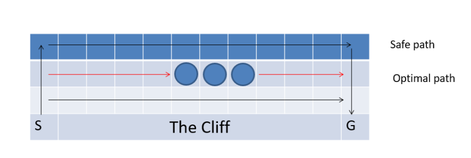

# 深度学习Q-learing算法实现


---------
## 1. 问题分析


>这是一个走悬崖的问题。强化学习中的主体从S出发走到G处一个回合结束，除了在边缘以外都有上下左右四个行动，如果主体走入悬崖区域，回报为-100，走入中间三个圆圈中的任一个，会得到-1的奖励，走入其他所有的位置，回报都为-5。

这是一个经典的Q-learing问题走悬崖的问题，也就是让我们选择的最大利益的路径，可以将图片转化为`reward矩阵`
```python
[[  -5.   -5.   -5.   -5.   -5.   -5.   -5.   -5.   -5.   -5.   -5.   -5.]
 [  -5.   -5.   -5.   -5.   -5.   -1.   -1.   -1.   -5.   -5.   -5.   -5.]
 [  -5.   -5.   -5.   -5.   -5.   -5.   -5.   -5.   -5.   -5.   -5.   -5.]
 [  -5. -100. -100. -100. -100. -100. -100. -100. -100. -100. -100.  100.]]
```
我们的目标就是让agent从s(3,0)到达g(3,11)寻找之间利益最大化的路径，学习最优的策略。
## 2. Q—learing理论分析
在Q-learing算法中有两个特别重要的术语：`状态(state)`,`行为(action)`,在我们这个题目中，state对应的就是我们的agent在悬崖地图中所处的位置，action也就是agent下一步的活动，我的设定是（0， 1 ，2，3，4）对应的为（原地不动，上，下，左，右），需要注意的事我们的next action是随机的但是也是取决于目前的状态（current state）。

我们的核心为Q-learing的`转移规则(transition rule)`,我们依靠这个规则去不断地学习，并把agent学习的经验都储存在Q-stable，并不断迭代去不断地积累经验，最后到达我们设定的目标，这样一个不断试错，学习的过程，最后到达目标的过程为一个`episode`
$$Q(s,a) = R(s,a)+\gamma *max \lbrace Q(\tilde{s},\tilde{a}) \rbrace $$
其中$s,a$表示现在状态的state和action，$\tilde{s},\tilde{a}$表示下一个状态的state和action，学习参数为$0<\gamma<1$，越接近1代表约考虑远期结果。
在Q-table初始化时由于agent对于周围的环境一无所知，所以初始化为零矩阵。
## 3. 算法实现
**参考以下伪代码：**

具体程序如见附录
**程序的关键点：**
1. 核心代码即为伪代码，但是各种方法需要自己实现，在程序中有注释可以参考
2. 需要判断agent在一个状态下可以使用的行动，这一点我用`valid_action(self, current_state)`实现

**发现的问题：**题目中的目标点为G 的目标值也是为-1，但是程序会走到这个一步但是函数没有收敛到此处，而且由于在奖励点收益大，所以最后的agent会收敛到奖励点处，在三个奖励点处来回移动。所有我将最后的目标点G的值改为了100，函数可以收敛到此处。后来也看到文献中的`吸收目标`

## 3. 结果展示
最后到Q-tabel矩阵由于太大放到附录查看，但是同时为了更加直观的看到运行结果，
编写了动态绘图的程序 画出了所有的路径。**如果需要查看动态图片请运行程序**最终结果如下图：

从图中可以看到agent避过了所有的悬崖，而且收获了所有的奖励最终到达目标。

###4.附录

**程序：**
```python
	#-*- utf-8 -*-
	# qvkang
	import numpy as np
	import random
	import turtle as t
	class Cliff(object):
	    def __init__(self):
	        self.reward = self._reward_init()
	        print(self.reward)
	        self.row = 4
	        self.col = 12
	        self.gamma = 0.7
	        self.start_state = (3, 0)
	        self.end_state = (3, 11)
	        self.q_matrix = np.zeros((4,12,5))
	        self.main()
	
	    def _reward_init(self):
	        re = np.ones((4,12))*-5
	        # 奖励
	        re[1][5:8] = np.ones((3))*-1
	        # 悬崖
	        re[3][1:11] = np.ones((10))*-100
	        #目标
	        re[3][11] = 100
	        return re
	
	    def valid_action(self, current_state):
	        # 判断当前状态下可以走的方向
	        itemrow, itemcol = current_state
	        valid = [0]
	        if(itemrow-1 >= 0): valid.append(1)
	        if(itemrow+1 <= self.row-1):valid.append(2)
	        if(itemcol-1 >= 0): valid.append(3)
	        if(itemcol+1 <= self.col-1): valid.append(4)
	        return valid
	
	    def transition(self, current_state, action):
	        # 从当前状态转移到下一个状态
	        itemrow, itemcol = current_state
	        if (action is 0):   next_state = current_state
	        if (action is 1):   next_state = (itemrow-1, itemcol)
	        if (action is 2):   next_state = (itemrow+1, itemcol)
	        if (action is 3):   next_state = (itemrow, itemcol-1)
	        if (action is 4):   next_state = (itemrow, itemcol+1)
	        return(next_state)
	    def _indextoPosition(self,index):
	        index += 1
	        itemrow = int(np.floor(index/self.col))
	        itemcol = index%self.col
	        return(itemrow, itemcol)
	
	    def _positiontoIndex(self,itemrow,itemcol):
	        itemindex = (itemrow)*self.col+itemcol-1
	        return itemindex
	    
	    def getreward(self, current_state, action):
	        # 得到下一步的奖励
	        next_state = self.transition(current_state, action)
	        next_row, next_col = next_state
	        r = self.reward[next_row, next_col]
	        return r
	    def path(self):
	        #绘图path  使用turtle的绘图库
	        t.speed(10)
	        t.begin_fill()
	        paths = []
	        current_state = self.start_state
	        t.pensize(5)
	        t.penup()
	        t.goto(current_state)
	        t.pendown()
	        #移动到初始位置
	        paths.append(current_state)
	        while current_state != self.end_state:
	            current_row, current_col = current_state
	            valid_action = self.valid_action(current_state)
	            valid_value = [self.q_matrix[current_row][current_col][x] for x in valid_action]
	            max_value = max(valid_value)
	            action = np.where(self.q_matrix[current_row][current_col] == max_value)
	            print(current_state,'-------------',action)
	            next_state = self.transition(current_state,int(random.choice(action[0])))
	            paths.append(next_state)
	            next_row,next_col = next_state
	            t.goto(next_col*20, 60-next_row*20)
	            current_state = next_state
	
	    def main(self):
	        #主要循环迭代
	        for i in range(1000):
	            current_state = self.start_state
	            while current_state != self.end_state:
	                action = random.choice(self.valid_action(current_state))
	                next_state = self.transition(current_state, action)
	                future_rewards = []
	                for action_next in self.valid_action(next_state):
	                    next_row, next_col = next_state
	                    future_rewards.append(self.q_matrix[next_row][next_col][action_next])
	                #core trasmite rule
	                q_state = self.getreward(current_state, action) + self.gamma*max(future_rewards)
	                current_row, current_col = current_state
	                self.q_matrix[current_row][current_col][action] = q_state
	                current_state = next_state
	                #print(self.q_matrix)
	        #绘图1000次
	        for i in range(1000):
	            self.path()
	        print(self.q_matrix)
	
	if __name__ == "__main__":
	    Cliff()
	
	
	    
	
```
**Q-table矩阵最终结果：**
``` python
	[[[ -14.84480118    0.          -14.06400168    0.          -14.06400168]
	  [ -14.06400168    0.          -12.94857383  -14.84480118  -12.94857383]
	  [ -12.94857383    0.          -11.35510547  -14.06400168  -11.35510547]
	  [ -11.35510547    0.           -9.07872209  -12.94857383   -9.07872209]
	  [  -9.07872209    0.           -5.82674585  -11.35510547   -5.82674585]
	  [  -5.82674585    0.           -1.1810655    -9.07872209   -5.1810655 ]
	  [  -5.1810655     0.           -0.258665     -5.82674585   -4.258665  ]
	  [  -4.258665      0.            1.05905      -5.1810655    -2.94095   ]
	  [  -2.94095       0.            2.9415       -4.258665      2.9415    ]
	  [   2.9415        0.           11.345        -2.94095      11.345     ]
	  [  11.345         0.           23.35          2.9415       23.35      ]
	  [  23.35          0.           40.5          11.345         0.        ]]
	
	 [[ -14.06400168  -14.84480118  -14.84480118    0.          -12.94857383]
	  [ -12.94857383  -14.06400168  -14.06400168  -14.06400168  -11.35510547]
	  [ -11.35510547  -12.94857383  -12.94857383  -12.94857383   -9.07872209]
	  [  -9.07872209  -11.35510547  -11.35510547  -11.35510547   -5.82674585]
	  [  -5.82674585   -9.07872209   -9.07872209   -9.07872209   -1.1810655 ]
	  [  -1.1810655    -5.82674585   -5.82674585   -5.82674585   -0.258665  ]
	  [  -0.258665     -5.1810655    -2.94095      -1.1810655     1.05905   ]
	  [   1.05905      -4.258665      2.9415       -0.258665      2.9415    ]
	  [   2.9415       -2.94095      11.345         1.05905      11.345     ]
	  [  11.345         2.9415       23.35          2.9415       23.35      ]
	  [  23.35         11.345        40.5          11.345        40.5       ]
	  [  40.5          23.35         65.           23.35          0.        ]]
	
	 [[ -14.84480118  -14.06400168  -15.39136082    0.          -14.06400168]
	  [ -14.06400168  -12.94857383 -109.84480118  -14.84480118  -12.94857383]
	  [ -12.94857383  -11.35510547 -109.06400168  -14.06400168  -11.35510547]
	  [ -11.35510547   -9.07872209 -107.94857383  -12.94857383   -9.07872209]
	  [  -9.07872209   -5.82674585 -106.35510547  -11.35510547   -5.82674585]
	  [  -5.82674585   -1.1810655  -104.0787221    -9.07872209   -2.94095   ]
	  [  -2.94095      -0.258665   -102.058665     -5.82674585    2.9415    ]
	  [   2.9415        1.05905     -97.94095      -2.94095      11.345     ]
	  [  11.345         2.9415      -92.0585        2.9415       23.35      ]
	  [  23.35         11.345       -83.655        11.345        40.5       ]
	  [  40.5          23.35        -30.           23.35         65.        ]
	  [  65.           40.5         100.           40.5           0.        ]]
	
	 [[ -15.39136082  -14.84480118    0.            0.         -109.84480118]
	  [-109.84480118  -14.06400168    0.          -15.39136082 -109.06400168]
	  [-109.06400168  -12.94857383    0.         -109.84480118 -107.94857383]
	  [-107.94857383  -11.35510547    0.         -109.06400168 -106.35510547]
	  [-106.35510547   -9.07872209    0.         -107.94857383 -104.0787221 ]
	  [-104.0787221    -5.82674585    0.         -106.35510547 -102.058665  ]
	  [-102.058665     -2.94095       0.         -104.0787221   -97.94095   ]
	  [ -97.94095       2.9415        0.         -102.058665    -92.0585    ]
	  [ -92.0585       11.345         0.          -97.94095     -83.655     ]
	  [ -83.655        23.35          0.          -92.0585      -30.        ]
	  [ -30.           40.5           0.          -83.655       100.        ]
	  [   0.            0.            0.            0.            0.        ]]]
```

